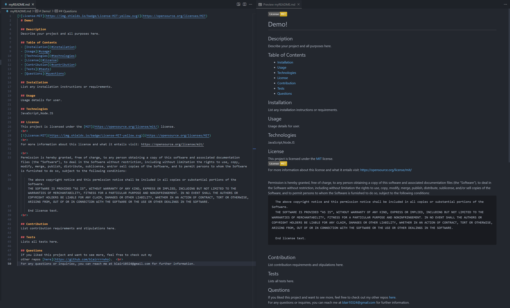

# Professional README Generator

## Description

This is a command-line application that accepts user input to quickly generate a professional README for a user's new project. It does so by using the terminal that accepts user input via prompts and then creates a markdown file, personalized for that user's project. 

It allows the user to quickly generate a README template for project with included necessary information personalized by that user.   

## Table of Contents (Optional)

If your README is long, add a table of contents to make it easy for users to find what they need.

- [Installation](#installation)
- [Usage](#usage)
- [Demo](#demo)
- [Screenshots of App](#screenhots-of-app)
- [License](#license)
- [Contribution](#how-to-contribute)
- [Tests](#tests)
- [Contact Information](#contact-information)

## Installation

To install this application, do the following:
1. Clone the repo
2. Open the repo and go to the repo directory in your terminal
3. Run: node index.js (or: node index)
Your README file should generate and be given the title: "myREADME.md"

## Usage (Instructions/How-To Use)

This application will utilize node.js to generate a personalized README for your project, based off of your input. Users are to run node index from their terminal within the repo root folder. Once the command is ran and the input is selected, then the user must answer the proceeding questions. If all is well, the application will generated your very own README for specific repos. 

## Demo
Link to Full Video: <a href="https://clipchamp.com/watch/bltCdMHOUOl">Demo</a>

Terminal:

Full:

## Screenhots of App
Terminal:

myREADME file generated:

## License

This project is licensed under the MIT license. For more information about this license and what it entails visit: https://opensource.org/licenses/MIT

## How to Contribute
Users can close the repo to run the application and/or make their own README generator. 
Forks are allowed but pull requests must be approved before merging -- please shoot me an email with questions about forking or collaborating.

## Tests
No tests are needed at this time.

## Contact Information
  If you liked this project and want to see more, feel free to check out my 
  other repos [here](https://github.com/blairrrrwho).
   
  For any questions or inquiries, you can reach me at blair10324@gmail.com for further information.